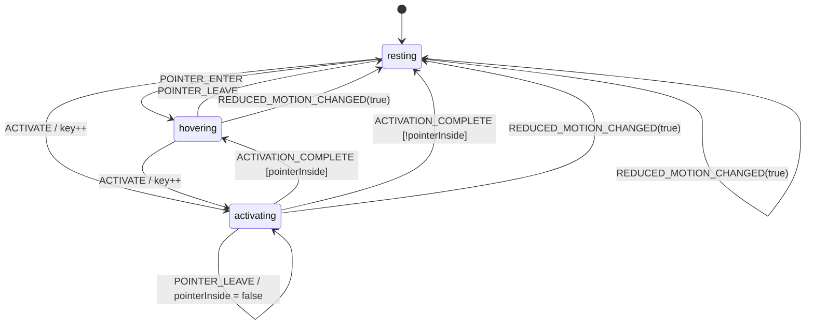

# Design Document

## Overview

The feature adds a 48×48 animated mascot to the top-right of the site navigation row. It is built from four separable layers, each in its own module family, so that media generation, clip metadata, playback decisions and rendering can be changed independently:

1. **Media_Pipeline** — a committed Node script (`scripts/mascot-clips/`) that provisions ffmpeg, probes the two source videos, cuts the motion segments declared in a single configuration module, crops each segment to one shared square region and encodes 96×96 looping GIFs under a size budget, copies the fallback still, and emits a generated TypeScript manifest of measured facts (path, width, height, duration, fps, bytes).
2. **Clip_Registry** — hand-authored data (`src/features/mascot/data/`) that assigns a `ClipRole` and a human label to each manifest entry and exposes Nav_Slot sizing and timing constants. The registry is the only place the UI reads paths, dimensions and timings from.
3. **Playback_Engine** — a pure, DOM-free state machine (`src/features/mascot/engine/`) consisting of an initial state, a total transition function over an event union, and a resolver that maps a state plus a registry to exactly one displayable frame.
4. **React integration** — hooks (`src/features/mascot/hooks/`) that own engine state, environment signals (`prefers-reduced-motion`, `document.visibilityState`), the activation timer and the browser-side clip source lifecycle; plus a thin presentational view (`src/features/mascot/components/`) mounted from `src/components/SiteNav.tsx`.

---

## Architecture

The layering follows the existing `src/features/mascot/` convention (`data/` → `engine/` → `components/`) and the `MASCOT_CONFIG as CFG` import-alias pattern. One new sibling folder, `hooks/`, is introduced so that browser-coupled logic never lands in `engine/` (Requirement 6.11, 12.1). No existing module name is reused: every new module is prefixed `navbarMascot*` to avoid collision with the 3D mascot modules (`mascotConfig`, `mascotPhysics`, `mascotMeshBuilder`, `types`, `MascotCanvas`, `MascotHeroSection`, `MascotHUDOverlay`).

### Dependency direction

```
scripts/mascot-clips/*.mjs ──emits──▶ data/navbarMascotClipManifest.generated.ts
                                                  │
                                                  ▼
data/navbarMascotConfig.ts ──────────▶ data/navbarMascotClips.ts
                                                  │  (types + data only)
                                                  ▼
                              engine/navbarMascotPlaybackTypes.ts
                              engine/navbarMascotPlayback.ts          ← pure, Node-safe
                                                  │
                                                  ▼
       hooks/useEnvironmentFlags.ts ──▶ hooks/useNavbarMascot.ts ──▶ hooks/useClipSource.ts
                                                  │
                                                  ▼
                      components/NavbarMascot.tsx ──▶ components/NavbarMascotView.tsx
                                                  │
                                                  ▼
                                      src/components/SiteNav.tsx
```

Arrows are the only permitted import directions. `engine/` imports types from `data/` and nothing else; it must never import React, `next/*`, or touch `window`, `document`, `fetch`, `performance` or timers.

---

### 1. Media Pipeline

#### 1.1 Layout and entry point

```
scripts/mascot-clips/
  clipPipelineConfig.mjs     # every tunable: segments, height, fps ladder, palette, budgets, paths
  ensureEncoder.mjs          # ffmpeg/ffprobe verification + winget/choco provisioning
  probeSources.mjs           # ffprobe of the two source videos
  detectSegments.mjs         # scene-change probing (advisory only, never writes config)
  encodeClips.mjs            # two-pass palettegen/paletteuse + size ladder
  writeManifest.mjs          # measure outputs, copy still, emit generated .ts manifest
  generate-mascot-clips.mjs  # CLI orchestrator
```

`package.json` gains:

```json
"scripts": {
  "mascot:clips": "node scripts/mascot-clips/generate-mascot-clips.mjs",
  "mascot:clips:probe": "node scripts/mascot-clips/generate-mascot-clips.mjs --probe-segments",
  "mascot:clips:verify": "node scripts/mascot-clips/generate-mascot-clips.mjs --verify-only"
}
```

`npm run mascot:clips` from the repository root is the single documented command (Requirement 12.2). Plain `.mjs` is used rather than TypeScript so no loader or build step is needed; the script is the only JavaScript in the repo that runs outside Next.

#### 1.2 Configuration module (single source of tunables — Requirement 12.3)

```js
// scripts/mascot-clips/clipPipelineConfig.mjs
export const SOURCE_DIR = "assets/mascot";
export const STILL_SOURCE = "ChatGPT Image Sep 26, 2026, 03_48_55 PM.png";
export const STILL_OUTPUT = "public/assets/mascot/pingu-tiwari-still.png";
export const CLIP_OUTPUT_DIR = "public/assets/mascot/clips";
export const MANIFEST_OUTPUT = "src/features/mascot/data/navbarMascotClipManifest.generated.ts";

export const SOURCES = {
  a: "gemini_generated_video_284857f9.mp4",
  b: "gemini_generated_video_3c0a4e76.mp4",
};

/** Output geometry — 96×96 so the 48 px slot renders at 2× device pixels. */
export const OUTPUT_HEIGHT_PX = 96;
export const OUTPUT_WIDTH_PX = 96;

/**
 * Crop rectangle in SOURCE pixel coordinates, applied before scaling.
 * The sources are 1280×720 and the mascot occupies roughly the middle third,
 * so encoding at the source aspect ratio would render the mascot at ~18 CSS px
 * inside the 48 px slot. A square crop around the mascot fills the slot instead.
 * Square width/height keeps the scale to 96×96 uniform — reframing, not stretching.
 */
export const CROP_RECT = { x: 480, y: 0, width: 720, height: 720 };

/** Frame-rate window permitted by the spec; the ladder never leaves it. */
export const FPS_RANGE = { min: 12, max: 20 };

/**
 * Deterministic quality ladder. The first rung whose encode is within
 * MAX_CLIP_BYTES wins; rungs are tried strictly in order.
 */
export const QUALITY_LADDER = [
  { fps: 20, palette: 128, dither: "bayer:bayer_scale=3" },
  { fps: 16, palette: 128, dither: "bayer:bayer_scale=3" },
  { fps: 16, palette: 96,  dither: "bayer:bayer_scale=4" },
  { fps: 14, palette: 80,  dither: "bayer:bayer_scale=4" },
  { fps: 12, palette: 64,  dither: "bayer:bayer_scale=5" },
];

export const MAX_CLIP_BYTES = 300 * 1024;      // 307200
export const MAX_TOTAL_BYTES = 1200 * 1024;    // 1228800
export const DURATION_RANGE_S = { min: 0.6, max: 4.0 };

/** Advisory probe threshold used by --probe-segments only. */
export const SCENE_CHANGE_THRESHOLD = 0.25;

/**
 * THE authoritative segment table. Hand-authored from --probe-segments output.
 * Times are seconds with two decimals. Nothing in the pipeline mutates this.
 */
export const SEGMENTS = [
  { id: "idle-bob",     source: "a", start: 0.00, end: 2.40, label: "Idle bob" },
  { id: "hover-turn",   source: "b", start: 0.00, end: 2.00, label: "Turn toward viewer" },
  { id: "activate-wave",source: "a", start: 2.40, end: 4.20, label: "Flipper wave" },
];
```

`CROP_RECT` is a tunable like everything else in this module: a single square rectangle in source pixels, shared by **every** clip so the mascot never changes size or position when the navbar swaps clips (Requirement 4.11). Its starting values above are provisional; during implementation they are chosen empirically from sampled frames across all committed segment windows — including the airborne apex of the hop segment, which is the frame that sets the top edge — and then committed.

The `SEGMENTS` values above are the starting table. During implementation they are replaced by boundaries read off `--probe-segments` output and visual review, then committed. Because encoding reads boundaries *only* from this table (never from a fresh probe), a rerun reproduces byte-identical cuts (Requirements 3.6, 12.4).

#### 1.3 Toolchain provisioning (Requirement 2)

`ensureEncoder.mjs` exports `ensureEncoder()`:

1. Run `ffmpeg -version` and `ffprobe -version` through `execFile` (respecting `MASCOT_FFMPEG_BIN` / `MASCOT_FFPROBE_BIN` overrides, which also make the failure branch testable).
2. On failure, attempt, in order:
   - `winget install --id Gyan.FFmpeg -e --accept-source-agreements --accept-package-agreements`
   - `choco install ffmpeg -y`
   Then re-verify. Because installers extend `PATH` only for new shells, verification retries with the well-known install locations (`%LOCALAPPDATA%\Microsoft\WinGet\Links`, `C:\ProgramData\chocolatey\bin`) before giving up.
3. If still not invocable, `console.error` the exact failing command plus the manual command (`winget install --id Gyan.FFmpeg -e`) and `process.exit(1)` (Requirement 2.3).

`ffmpeg` availability is checked before any probe or encode step runs (Requirement 2.1).

#### 1.4 Probing and segment discovery (Requirements 2.4, 3)

`probeSources.mjs`:

```
ffprobe -v error -select_streams v:0 \
  -show_entries stream=width,height,r_frame_rate,nb_frames \
  -show_entries format=duration -of json <source>
```

The parsed `{ width, height, fps, nbFrames, durationS }` per source is printed (Requirement 2.4) and used to validate that every segment range lies inside the probed duration (Requirement 3.3) and that `CROP_RECT` lies wholly inside the source frame (Requirement 4.1).

`detectSegments.mjs` (only under `--probe-segments`, never during a normal run):

```
ffmpeg -hide_banner -i <source> -an \
  -vf "select='gt(scene,0.25)',metadata=print:file=-" -f null -
```

It parses `pts_time` values, clamps them to two decimals, prints a ready-to-paste `SEGMENTS` block, and exits without writing files. Boundary selection stays a human decision so reruns are deterministic.

#### 1.5 Encoding (Requirement 4)

Two-pass palette generation gives the best quality at small sizes. For each segment and each ladder rung:

**Pass 1 — palette**

```
ffmpeg -y -hide_banner -ss <start> -t <duration> -i <source> \
  -vf "fps=<fps>,crop=<cw>:<ch>:<cx>:<cy>,scale=96:96:flags=lanczos,palettegen=max_colors=<palette>:stats_mode=diff" \
  -frames:v 1 <tmp>/palette-<id>.png
```

**Pass 2 — encode**

```
ffmpeg -y -hide_banner -ss <start> -t <duration> -i <source> -i <tmp>/palette-<id>.png \
  -lavfi "fps=<fps>,crop=<cw>:<ch>:<cx>:<cy>,scale=96:96:flags=lanczos[v];[v][1:v]paletteuse=dither=<dither>:diff_mode=rectangle" \
  -loop 0 <CLIP_OUTPUT_DIR>/mascot-<id>.gif
```

Notes on the invocation shape:

- `-ss`/`-t` precede `-i` in both passes so the palette is generated from exactly the frames that get encoded.
- `crop` runs **before** `scale`, with `<cw>:<ch>:<cx>:<cy>` taken from `CROP_RECT` (Requirements 4.1, 4.11). Cropping first means the palette and the dither are computed from only the pixels that survive, which also helps the size budget.
- `scale=96:96` produces the square output (Requirement 4.9). Because `CROP_RECT` is itself square, both axes scale by the same factor, so the mascot is reframed rather than stretched — no anamorphic distortion (Requirement 4.10). Encoding at the source aspect ratio instead would yield a 170×96 clip in which the mascot renders at roughly 18 CSS px inside the 48 px slot.
- `stats_mode=diff` biases the palette toward moving pixels; `diff_mode=rectangle` limits re-dithering to changed regions, which is the single biggest GIF size win for a mostly-static mascot.
- `-loop 0` writes infinite-loop metadata (Requirement 4.3).
- The palette PNG goes to a temp directory (`node:os.tmpdir()`) and is deleted afterwards, so nothing extra is committed.

**Size ladder (Requirements 4.4, 4.6, 4.7).** `selectLadderRung()` is a pure function `(rungs, encodeFn) => { rung, bytes }` that walks `QUALITY_LADDER` in order, stats each output, and stops at the first rung with `bytes <= MAX_CLIP_BYTES`. Because the ladder's last rung is 12 fps / 64 colours, "reduce until 300 KB or 12 fps is reached" is expressed as data rather than control flow, and the whole ladder stays inside the 12–20 fps window (Requirement 4.2). If the last rung is still oversized, the pipeline prints the clip id and measured byte size and exits non-zero (Requirement 4.7). Injecting `encodeFn` makes the selector unit- and property-testable without ffmpeg.

After all clips are encoded, the summed size is checked against `MAX_TOTAL_BYTES` (Requirement 4.5), and every clip's name, duration, dimensions and byte size is printed (Requirement 4.8).

#### 1.6 Ingestion and manifest emission (Requirements 1, 12.4)

`writeManifest.mjs`:

- Copies the still to `public/assets/mascot/pingu-tiwari-still.png` with `fs.copyFile` (sources are only ever read, so Requirement 1.3 holds by construction).
- Before each write, `existsSync` is checked and an `overwrite: <path>` line is logged (Requirement 1.4).
- Re-probes each produced GIF (`width`, `height`, `nb_frames`, `duration`) and `fs.stat`s its size.
- Emits the manifest with entries sorted by clip id so the file is byte-stable across runs:

```ts
// src/features/mascot/data/navbarMascotClipManifest.generated.ts
// GENERATED by `npm run mascot:clips` — do not edit by hand.
export const NAVBAR_MASCOT_CLIP_MANIFEST = [
  { id: "activate-wave", path: "/assets/mascot/clips/mascot-activate-wave.gif",
    width: 96, height: 96, durationMs: 1800, fps: 16, bytes: 214_512 },
  // ...
] as const;

export const NAVBAR_MASCOT_STILL_MANIFEST = {
  path: "/assets/mascot/pingu-tiwari-still.png", width: 1024, height: 1024,
} as const;
```

Generating measured facts removes the risk of hand-copied dimensions drifting from the files, which Requirement 10.5 depends on. All identifiers and file names are kebab-case (Requirements 1.1, 1.2).

### 5. Navigation Bar Integration

`src/components/SiteNav.tsx` already renders `<nav class="flex items-stretch justify-between …">` containing: wordmark `<Link>`, desktop `<ul class="hidden flex-1 items-stretch md:flex">` ending in the `EXEC /JOIN` `<li>`, then the `md:hidden` MENU `<button>`. A single slot inserted **between the `</ul>` and the MENU button** satisfies both breakpoint requirements at once:

- At `md` and above the MENU button is hidden, so the slot is the last element of the row (Requirement 7.1).
- Below `md` the `<ul>` is hidden and the slot sits immediately before the visible MENU button (Requirement 7.2).

```tsx
          </ul>

          {/* Navbar mascot — last row element at md+, immediately before MENU below md */}
          <div className="flex shrink-0 items-center px-4 md:border-l md:border-jlug-line md:px-5">
            <NavbarMascot />
          </div>

          {/* Mobile toggle */}
          <button
            type="button"
```

with `import NavbarMascot from "@/features/mascot/components/NavbarMascot";` added to the existing import block.

Why row height is unchanged (Requirement 7.5): the row's height is set by its tallest item, the wordmark link (`py-4` around a `text-base` line ≈ 56 px). The slot uses `items-center` with no vertical padding and a 48 px inner box, so it stretches to the row height without contributing to it. The slot is `shrink-0` and carries no `flex-1`, so the wordmark, the link list and the CTA keep their current positions and the `justify-between` distribution is untouched (Requirement 7.4). The slot lives in the `<nav>` row, not in the `#site-nav-mobile` panel, so it stays visible while the panel is open (Requirement 7.6). The 48 px box is fixed with no responsive variants (Requirement 7.3).

Implementation must confirm 7.5 empirically: record `document.querySelector("header").offsetHeight` at 375 px, 768 px and 1440 px widths before and after the change.

---

## Data Models

### 2. Clip Registry Data Layer

#### 2.1 Types and configuration

```ts
// src/features/mascot/data/navbarMascotConfig.ts
export const NAVBAR_MASCOT_CONFIG = {
  /** Nav_Slot box, CSS px. Drives both the container and the img attributes. */
  slotSizePx: 48,
  /** Extra time after the activate clip's own duration before resolving back. */
  activationTailMs: 80,
  /** Grace period after pointer-leave before the idle clip is requested. */
  hoverReleaseDelayMs: 120,
  reducedMotionQuery: "(prefers-reduced-motion: reduce)",
  /** Abort a clip fetch that stalls; falls back to the still. */
  clipFetchTimeoutMs: 6000,
  accessibleName: "Pingu Tiwari mascot — activate for a reaction",
} as const;
```

```ts
// src/features/mascot/data/navbarMascotClips.ts
import { NAVBAR_MASCOT_CLIP_MANIFEST, NAVBAR_MASCOT_STILL_MANIFEST } from "./navbarMascotClipManifest.generated";
import { NAVBAR_MASCOT_CONFIG as NAV_CFG } from "./navbarMascotConfig";

export type ClipRole = "idle" | "hover" | "activate";

export interface MascotClip {
  readonly id: string;
  readonly label: string;
  readonly role: ClipRole;
  readonly path: string;
  readonly width: number;
  readonly height: number;
  readonly durationMs: number;
}

export interface MascotStill {
  readonly path: string;
  readonly width: number;
  readonly height: number;
}

export type MascotClipRegistry = ReadonlyArray<MascotClip>;

/** Role assignment is authored here; measurements come from the manifest. */
const ROLE_BY_CLIP_ID: Readonly<Record<string, ClipRole>> = {
  "idle-bob": "idle",
  "hover-turn": "hover",
  "activate-wave": "activate",
};

const LABEL_BY_CLIP_ID: Readonly<Record<string, string>> = {
  "idle-bob": "Idle bob",
  "hover-turn": "Turn toward viewer",
  "activate-wave": "Flipper wave",
};

export const NAVBAR_MASCOT_CLIPS: MascotClipRegistry = /* manifest ∩ role map */ [];

export const NAVBAR_MASCOT_STILL: MascotStill = NAVBAR_MASCOT_STILL_MANIFEST;

export function getClipByRole(registry: MascotClipRegistry, role: ClipRole): MascotClip { /* ... */ }

/** Requirement 5.4: activation playback duration as a named value. */
export const ACTIVATION_DURATION_MS =
  getClipByRole(NAVBAR_MASCOT_CLIPS, "activate").durationMs + NAV_CFG.activationTailMs;
```

`NAVBAR_MASCOT_CLIPS` is built by mapping the manifest through `ROLE_BY_CLIP_ID`, dropping manifest entries with no role and throwing at module load if a role is missing or duplicated. That makes "exactly one clip per role" (Requirement 5.2) a load-time invariant rather than a runtime hazard, and lets the pipeline produce more clips later than the three the navbar consumes. `getClipByRole` is total for the three roles by that same invariant.

The registry is the only module the view and hooks read paths, dimensions and timings from (Requirement 5.5); the view receives them as props and contains no literals other than Tailwind classes.

---

## Components and Interfaces

### 3. Playback Engine

Pure, synchronous, no imports beyond registry *types*. Timing, media queries, visibility and DOM work all live above it.

#### 3.1 Types

```ts
// src/features/mascot/engine/navbarMascotPlaybackTypes.ts
import type { ClipRole, MascotClip, MascotClipRegistry, MascotStill } from "../data/navbarMascotClips";

export type PlaybackPhase = "resting" | "hovering" | "activating";

export interface PlaybackState {
  readonly phase: PlaybackPhase;
  /** Last recorded pointer/focus state; retained across activation (Req 6.8). */
  readonly pointerInside: boolean;
  readonly reducedMotion: boolean;
  /** Monotone counter; every activation start increments it (Req 6.9). */
  readonly restartKey: number;
}

export type PlaybackEvent =
  | { readonly type: "POINTER_ENTER" }
  | { readonly type: "POINTER_LEAVE" }
  | { readonly type: "ACTIVATE" }
  | { readonly type: "ACTIVATION_COMPLETE" }
  | { readonly type: "REDUCED_MOTION_CHANGED"; readonly reduced: boolean };

export type ResolvedFrame =
  | { readonly kind: "still"; readonly still: MascotStill; readonly restartKey: 0 }
  | { readonly kind: "clip"; readonly clip: MascotClip; readonly role: ClipRole;
      readonly loop: boolean; readonly restartKey: number };

export type PlaybackResolver = (state: PlaybackState, registry: MascotClipRegistry, still: MascotStill) => ResolvedFrame;
```

The resolver takes the registry as a parameter rather than importing it. That keeps the engine free of data coupling and lets property tests generate arbitrary role-complete registries.

#### 3.2 API

```ts
// src/features/mascot/engine/navbarMascotPlayback.ts
export const INITIAL_PLAYBACK_STATE: PlaybackState;
export function reducePlayback(state: PlaybackState, event: PlaybackEvent): PlaybackState;
export function resolveFrame(state: PlaybackState, registry: MascotClipRegistry, still: MascotStill): ResolvedFrame;
export function isSameFrame(a: ResolvedFrame, b: ResolvedFrame): boolean;
```

`INITIAL_PLAYBACK_STATE` is `{ phase: "resting", pointerInside: false, reducedMotion: false, restartKey: 0 }`. `isSameFrame` compares clip id, loop and `restartKey`, and is what the hook uses to avoid emitting new view models (Requirement 11.3).

#### 3.3 Transition table

`reducePlayback` is an exhaustive switch over `event.type` and is therefore total over the event union. Reduced-motion columns apply to any phase.

| current phase | `POINTER_ENTER` | `POINTER_LEAVE` | `ACTIVATE` | `ACTIVATION_COMPLETE` |
| --- | --- | --- | --- | --- |
| `resting` | `hovering`, pointerInside = true | `resting`, pointerInside = false | `activating`, restartKey + 1, pointerInside unchanged | `resting` (no-op) |
| `hovering` | `hovering` (no-op, key unchanged) | `resting`, pointerInside = false | `activating`, restartKey + 1, pointerInside unchanged | `hovering` (no-op) |
| `activating` | `activating`, pointerInside = true (clip retained, Req 6.8) | `activating`, pointerInside = false (clip retained, Req 6.8) | `activating`, restartKey + 1 (restart, Req 6.9) | `pointerInside ? "hovering" : "resting"` (Req 6.7) |

`REDUCED_MOTION_CHANGED`:

- `reduced: true` → `{ phase: "resting", pointerInside: false, reducedMotion: true, restartKey }`. Resetting to the resting state means that leaving reduced motion lands on the idle clip, which is exactly Requirement 9.4.
- `reduced: false` → same state with `reducedMotion: false`; phase is already `resting` if reduce was ever on.



#### 3.4 State-to-clip resolver

```
resolveFrame(state, registry, still):
  if state.reducedMotion            → { kind: "still", still, restartKey: 0 }     # Req 6.10 short-circuit
  switch state.phase:
    "resting"    → clip(role "idle",     loop: true,  restartKey: state.restartKey)   # Req 6.3, 6.5
    "hovering"   → clip(role "hover",    loop: true,  restartKey: state.restartKey)   # Req 6.4
    "activating" → clip(role "activate", loop: false, restartKey: state.restartKey)   # Req 6.6
```

The reduced-motion branch is checked first and returns before any registry lookup, so no clip URL is ever derived — the basis for "requests no clip file" (Requirement 9.2). `loop` is `true` exactly for the non-`activate` roles, and `restartKey` is surfaced so the DOM layer can force a fresh GIF element (Requirement 6.9).

---

### 4. React Integration

#### 4.1 Environment signals — `hooks/useEnvironmentFlags.ts`

Two `useSyncExternalStore` subscriptions, which give a correct server snapshot and re-render only on real change (Requirement 11.3):

```ts
export function usePrefersReducedMotion(): boolean;   // matchMedia(NAV_CFG.reducedMotionQuery)
export function useDocumentHidden(): boolean;         // document.visibilityState === "hidden"
```

- `subscribe` attaches `change` / `visibilitychange` listeners and returns the matching `removeEventListener` (Requirement 11.6).
- `getServerSnapshot` returns `false` for both. Because the view renders the still until a clip source is ready, the server and first client paints agree regardless of the real media-query value, so there is no hydration mismatch (Requirement 10.1).
- `matchMedia` is only touched inside `subscribe`/`getSnapshot`, i.e. after mount (Requirement 9.1).

#### 4.2 Engine owner — `hooks/useNavbarMascot.ts`

Responsibilities, in order:

1. Hold `PlaybackState` in `useReducer(reducePlayback, INITIAL_PLAYBACK_STATE)`.
2. Feed `REDUCED_MOTION_CHANGED` from `usePrefersReducedMotion()` in an effect whenever the flag differs from `state.reducedMotion` (Requirements 9.3, 9.4).
3. Compute `frame = resolveFrame(state, NAVBAR_MASCOT_CLIPS, NAVBAR_MASCOT_STILL)` via `useMemo`.
4. Run the activation timer: on every `restartKey` change while `phase === "activating"`, `setTimeout(..., ACTIVATION_DURATION_MS)` dispatching `ACTIVATION_COMPLETE`. The effect's cleanup clears the previous timer, so a repeat activation restarts the countdown as well as the clip. Reduced motion skips the timer entirely.
5. Debounce pointer release: `POINTER_LEAVE` is dispatched after `NAV_CFG.hoverReleaseDelayMs`, cancelled if a `POINTER_ENTER` arrives first. This lives in the hook, not the engine, so the engine's pointer-leave semantics stay immediate and testable.
6. Delegate source resolution to `useClipSource`.
7. Return a flat view model:

```ts
export interface NavbarMascotViewModel {
  readonly imageSrc: string | null;      // null → nothing renderable (still failed)
  readonly imageKey: string;             // `${clipId}:${restartKey}` — forces a fresh element
  readonly sizePx: number;
  readonly accessibleName: string;
  readonly onPointerEnter: () => void;
  readonly onPointerLeave: () => void;
  readonly onFocus: () => void;
  readonly onBlur: () => void;
  readonly onActivate: () => void;
  readonly onImageError: () => void;
}
```

Handlers are `useCallback`-stable, so the memoised view re-renders only when `imageSrc`/`imageKey` change (Requirement 11.3). `onFocus`/`onBlur` map to pointer-enter/leave (Requirements 8.4, 8.5) and `onActivate` is the button's `onClick`, which native `Enter`/`Space` handling already triggers (Requirement 8.3).

#### 4.3 Clip source lifecycle — `hooks/useClipSource.ts`

This is where the awkward part of the feature lives: **a GIF cannot be seeked, paused or rewound through the DOM.** There is no `currentTime` equivalent for animated images. The only reliable lever is *which image resource the element points at*, because animation position is a property of the image resource, not the element. Three techniques were considered:

| Technique | Restart guaranteed? | Cost | Verdict |
| --- | --- | --- | --- |
| Remount the `` with the same `src` (React `key` bump) | No. Browsers share decoded animation state per URL, so a remounted element commonly joins the loop mid-way. | Free | Rejected — unreliable for Requirement 6.9 |
| Cache-busting query (`clip.gif?r=<restartKey>`) | Yes — a distinct URL is a distinct resource | A distinct URL is also a distinct HTTP cache key, so every restart re-downloads up to 300 KB | Fallback only |
| Fetch bytes once, then `URL.createObjectURL(blob)` per restart | Yes — a fresh `blob:` URL is always a fresh resource, so playback starts at frame 0 | One network request per clip for the session; one object URL alive at a time | **Chosen** |

Implementation:

```ts
interface ClipSourceRequest {
  readonly clipId: string | null;   // null → render the still
  readonly path: string | null;
  readonly restartKey: number;
  readonly enabled: boolean;        // false while reduced motion or document hidden
}
type ClipSourceStatus = "still" | "clip" | "error";
```

- `blobsRef: Map<clipId, Blob>` caches bytes for the session. A clip is fetched the first time its id appears in a request, so `hover` and `activate` stay unrequested until the matching event fires (Requirement 11.7) and nothing is fetched at all under reduced motion (Requirement 9.2).
- Each effect run revokes the previous object URL before creating the next one, so at most one clip resource is live and the DOM holds exactly one `` (Requirements 11.2, 11.6).
- `AbortController` plus `NAV_CFG.clipFetchTimeoutMs` bounds the fetch; rejection or timeout sets status `error`, which renders the still while leaving the button operable (Requirement 10.3).
- If `fetch` or `URL.createObjectURL` is unavailable, the hook degrades to the cache-busting query form. Behaviour is identical; only bandwidth differs.
- Until the idle clip's blob is ready, the returned source is the still — this is what makes SSR and first paint show the still and then swap (Requirements 10.1, 10.2).

**Pause and resume (Requirements 11.4, 11.5).** GIF playback also cannot be paused. When `useDocumentHidden()` becomes `true`, the hook sets `enabled: false`, which swaps the source to the static still and revokes the live object URL. That genuinely stops playback and releases the decoded frames instead of relying on browser background throttling. When the document becomes visible again, the effect re-runs, mints a new object URL from the cached blob, and playback resumes for the clip the engine currently resolves — from frame 0, which is the only resumption point a GIF offers. The cached blob means resuming costs no network.

#### 4.4 Components

`components/NavbarMascot.tsx` — `"use client"`, ~15 lines: calls `useNavbarMascot()` and spreads the view model into the view. No markup decisions.

`components/NavbarMascotView.tsx` — presentational, hook-free, prop-driven, therefore directly testable:

```tsx
export default function NavbarMascotView({
  imageSrc, imageKey, sizePx, accessibleName,
  onPointerEnter, onPointerLeave, onFocus, onBlur, onActivate, onImageError,
}: NavbarMascotViewModel) {
  return (
    <button
      type="button"
      aria-label={accessibleName}
      onClick={onActivate}
      onPointerEnter={onPointerEnter}
      onPointerLeave={onPointerLeave}
      onFocus={onFocus}
      onBlur={onBlur}
      style={{ width: sizePx, height: sizePx }}
      className="grid shrink-0 place-items-center bg-transparent focus-visible:outline-2 focus-visible:outline-offset-2 focus-visible:outline-jlug-accent"
    >
      {imageSrc ? (
        // eslint-disable-next-line @next/next/no-img-element -- animated GIF driven by blob: URLs; next/image adds nothing here
        
      ) : null}
    </button>
  );
}
```

`next/image` is deliberately not used: animated GIFs require `unoptimized`, which reduces it to a plain `` anyway, and it cannot accept `blob:` sources without extra configuration. A plain `` with explicit `width`/`height` keeps full control of `src` and `key`.

---

### 6. Accessibility and Fallback Rendering

| Concern | Decision |
| --- | --- |
| Semantics (8.1) | Native `<button type="button">`; no `div` with `role="button"` |
| Accessible name (8.2) | `aria-label={NAV_CFG.accessibleName}` = "Pingu Tiwari mascot — activate for a reaction" |
| Keyboard activation (8.3) | Native button click semantics for `Enter` and `Space` → `onActivate` |
| Focus behaviour (8.4, 8.5) | `onFocus` → pointer-enter, `onBlur` → pointer-leave |
| Focus indicator (8.4) | `focus-visible:outline-2 focus-visible:outline-offset-2 focus-visible:outline-jlug-accent`, matching the nav's existing pattern. The accent (`#b7f34a`) against the header background (`--jlug-black`, near `#050505`) is far above 3:1; the exact ratio is asserted in a token test |
| Decorative image (8.6) | `alt=""` plus `aria-hidden="true"`; only the button's label is announced |
| Tab order (8.7) | No `tabindex` anywhere; the slot's DOM position places it after the CTA and before MENU |
| Reduced motion (9.5) | Reduced motion changes only the rendered source. The button, its label and its focusability are identical in both modes |

Fallback and load paths:

- **SSR / first paint (10.1):** `imageSrc` starts at the still path, which is a static asset, so markup is identical on server and client.
- **Idle clip ready (10.2):** first successful blob swaps `imageSrc` to a `blob:` URL; the element is keyed by `${clipId}:${restartKey}` so the swap replaces rather than mutates the image.
- **Clip failure (10.3):** status `error` pins `imageSrc` to the still. Engine dispatch is unaffected, so hover/activation keep working (silently, from the user's perspective).
- **Still failure (10.4):** `onImageError` while showing the still sets `imageSrc` to `null`; the button renders as an empty 48×48 box. It inherits the header's `bg-jlug-black/90` through transparency, so the corner looks intentional rather than broken.
- **Reserved box (10.5, 11.1):** the button's inline `width`/`height` and the image's `width`/`height` attributes are all `NAV_CFG.slotSizePx`, so the box exists before any bytes arrive and layout never shifts.

---

## Error Handling

| Failure | Layer | Behaviour |
| --- | --- | --- |
| ffmpeg/ffprobe missing after install attempt | pipeline | exit 1, print failing command + manual command (2.3) |
| Segment range outside probed duration | pipeline | exit 1 before encoding, naming the segment id (3.3) |
| Clip over 300 KB at the last ladder rung | pipeline | exit 1 with clip id and bytes (4.7) |
| Combined size over 1200 KB | pipeline | exit 1 with the total (4.5) |
| Manifest entry with no role / duplicate role | registry | throw at module load, surfacing as a build error (5.2) |
| Unknown event type | engine | impossible by types; exhaustive switch returns the current state unchanged |
| Clip fetch reject / timeout / abort | `useClipSource` | status `error` → still; button stays operable (10.3) |
| Still image `onError` | view | `imageSrc = null` → empty reserved box (10.4) |
| `matchMedia` or `fetch` unavailable | hooks | reduced motion assumed `false`; source falls back to the cache-busting query form |

---

## Testing Strategy

No test runner is installed. **Add Vitest** (`vitest`, `@vitejs/plugin-react`, `jsdom`, `@testing-library/react`, `@testing-library/dom`, `vite-tsconfig-paths`, `fast-check`) with a `vitest.config.mts`. Rationale: it runs TypeScript ESM natively with no Babel or transform config, resolves the existing `@/*` paths through `vite-tsconfig-paths`, supports a single-run mode (`vitest --run`) for CI, and is the runner Next's own testing guide documents for this App Router version. Jest would need extra transform wiring for ESM/TS and gains nothing here.

Two projects in one config:

- `engine` — `environment: "node"`, matching `src/features/mascot/{engine,data}/**/*.test.ts`. Running the engine suite without jsdom is itself the check for Requirements 6.11 and 12.1: any accidental `window`/`document` reference fails the suite.
- `ui` — `environment: "jsdom"`, matching `src/features/mascot/{hooks,components}/**/*.test.tsx`.

Scripts: `"test": "vitest --run"`, `"test:watch": "vitest"`.

Dual approach:

- **Property tests** (`fast-check`, minimum 100 runs — the library default; set explicitly via `fc.assert(..., { numRuns: 100 })`) cover the engine, the registry invariants, the segment/manifest invariants and the pure size-ladder selector. Generators: `arbPlaybackState`, `arbPlaybackEvent`, `arbEventSequence` (arrays of events), `arbRoleCompleteRegistry`.
- **Unit and scenario tests** cover the view's three source states, the hook's timer/visibility/reduced-motion wiring with fake timers and stubbed `matchMedia`, the SiteNav DOM ordering, accessibility attributes, and the pipeline's failure branches via injected fakes.
- **Integration / manual checks** cover toolchain provisioning, nav row height, CLS, and pipeline rerun determinism.

Each property test is tagged in its test name:

```
Feature: navbar-mascot-animations, Property 3: For any event sequence whose most recent reduced-motion event set reduce, resolution is the fallback still
```

---

## Correctness Properties

*A property is a characteristic or behavior that should hold true across all valid executions of a system—essentially, a formal statement about what the system should do. Properties serve as the bridge between human-readable specifications and machine-verifiable correctness guarantees.*

### Property 1: Transitions are total over the event union

For any playback state and any event drawn from the playback event union, `reducePlayback` returns a structurally valid state: `phase` is one of `resting`, `hovering`, `activating`; `pointerInside` and `reducedMotion` are booleans; and `restartKey` is an integer no smaller than the input state's `restartKey`.

**Validates: Requirements 6.1, 6.11, 12.1**

### Property 2: Resolution is total, single-valued and registry-closed

For any playback state and any registry containing exactly one clip per role, `resolveFrame` returns exactly one frame; if that frame is a clip frame then its clip is an element of the registry, its role matches the state's phase, and `loop` is true if and only if the role is not `activate`.

**Validates: Requirements 6.2, 6.3, 5.1, 5.2**

### Property 3: Reduced motion dominates every event sequence

For any sequence of playback events applied to the initial state, if the most recent `REDUCED_MOTION_CHANGED` event in that sequence carried `reduced: true`, then the resolved frame is the fallback still and no clip is referenced.

**Validates: Requirements 6.10, 9.2, 9.3**

### Property 4: The quiescent resolution is the looping idle clip

For any sequence of playback events with reduced motion off, appending `POINTER_LEAVE` followed by `ACTIVATION_COMPLETE` resolves to the clip whose role is `idle`, with looping enabled.

**Validates: Requirements 6.3, 6.5, 6.7**

### Property 5: Pointer-enter with no activation in flight resolves to the looping hover clip

For any sequence of playback events with reduced motion off that leaves no activation in flight, appending `POINTER_ENTER` resolves to the clip whose role is `hover`, with looping enabled.

**Validates: Requirements 6.4**

### Property 6: Activation retains the non-looping activate clip across pointer events

For any playback state with reduced motion off, applying `ACTIVATE` followed by any finite sequence of `POINTER_ENTER` and `POINTER_LEAVE` events containing no `ACTIVATION_COMPLETE` resolves to the clip whose role is `activate`, with looping disabled.

**Validates: Requirements 6.6, 6.8**

### Property 7: Each activation restarts the clip exactly once

For any playback state and any integer n ≥ 1, applying n consecutive `ACTIVATE` events increases the resolved `restartKey` by exactly n, and the key is strictly greater after each individual `ACTIVATE`.

**Validates: Requirements 6.9**

### Property 8: Activation completion follows the last recorded pointer event

For any playback state with reduced motion off, applying `ACTIVATE`, then any non-empty finite sequence of pointer events, then `ACTIVATION_COMPLETE`, resolves to the `hover` clip if the last pointer event in that sequence was `POINTER_ENTER`, and to the `idle` clip otherwise; in both cases looping is enabled.

**Validates: Requirements 6.7, 6.8**

### Property 9: Repeated identical pointer events are idempotent

For any playback state and any single pointer event, applying that event twice yields a state equal to applying it once, and both yield equal resolved frames.

**Validates: Requirements 6.4, 6.5, 11.3**

### Property 10: Leaving reduced motion returns to the idle clip

For any playback state, applying `REDUCED_MOTION_CHANGED(true)` and then `REDUCED_MOTION_CHANGED(false)` resolves to the clip whose role is `idle`, with looping enabled.

**Validates: Requirements 9.4**

### Property 11: Every registry entry is complete and roles are uniquely assigned

For any role in the `ClipRole` union, the clip registry contains exactly one entry carrying that role; and for every registry entry, the id, label, role, path, width, height and duration in milliseconds are all present, the path matches the served clips directory with a kebab-case `.gif` name, and width, height and duration are positive.

**Validates: Requirements 5.1, 5.2, 1.2**

### Property 12: Every declared motion segment is a single valid in-range cut

For every entry in the pipeline segment table, the entry names exactly one source video and one time range, its id is unique across the table, its start and end are multiples of 0.01 seconds with 0 ≤ start < end ≤ the probed duration of that source, and its length lies between 0.60 and 4.00 seconds inclusive.

**Validates: Requirements 3.2, 3.3, 3.4**

### Property 13: Every encoded clip meets the geometry, frame-rate and size budget

For every entry in the generated clip manifest, the rendered width and height are both 96 pixels, and the encoded geometry matches the configured crop region scaled uniformly — that is, the crop region is square and lies wholly inside the probed source frame, so both axes carry the same scale factor and no anamorphic distortion is introduced; the recorded frame rate lies between 12 and 20 inclusive, the duration lies between 0.60 and 4.00 seconds inclusive, and the file size is at most 307200 bytes.

**Validates: Requirements 4.1, 4.2, 4.4, 4.9, 4.10, 4.11, 3.4**

### Property 14: The size ladder descends in order and stops at the first rung within budget

For any encoder whose reported output size is an arbitrary function of the ladder rung, the ladder selector attempts rungs strictly in configured order, returns the first rung whose size is at most 307200 bytes, never returns a rung outside the configured ladder, and fails rather than returning a rung once the ladder is exhausted.

**Validates: Requirements 4.6, 4.2, 4.7**

---

## File-by-File Plan

### New — media pipeline

| File | Responsibility |
| --- | --- |
| `scripts/mascot-clips/clipPipelineConfig.mjs` | Sole home of segment table, crop rectangle, output size, fps ladder, palette sizes, dither settings, size budgets and all input/output paths (Req 12.3) |
| `scripts/mascot-clips/ensureEncoder.mjs` | Verify `ffmpeg`/`ffprobe`, provision via winget then choco, re-verify, fail loudly (Req 2) |
| `scripts/mascot-clips/probeSources.mjs` | `ffprobe` each source video; return and print duration, dimensions, frame rate (Req 2.4) |
| `scripts/mascot-clips/detectSegments.mjs` | Advisory scene-change probe under `--probe-segments`; prints a paste-ready segment table, writes nothing (Req 3.6) |
| `scripts/mascot-clips/encodeClips.mjs` | Crop-then-scale two-pass palettegen/paletteuse encode per segment plus the pure `selectLadderRung` size ladder (Req 4.1–4.4, 4.6, 4.7, 4.9–4.11) |
| `scripts/mascot-clips/writeManifest.mjs` | Copy the still, re-measure outputs, report overwrites, emit the sorted generated manifest (Req 1.1, 1.2, 1.4, 4.8) |
| `scripts/mascot-clips/generate-mascot-clips.mjs` | CLI orchestrator and exit codes; `--verify-only`, `--probe-segments` (Req 12.2) |

### New — feature source

| File | Responsibility |
| --- | --- |
| `src/features/mascot/data/navbarMascotClipManifest.generated.ts` | Generated measured facts per clip and for the still; never hand-edited |
| `src/features/mascot/data/navbarMascotConfig.ts` | `NAVBAR_MASCOT_CONFIG`: slot size, activation tail, hover-release delay, reduced-motion query, fetch timeout, accessible name (Req 5.4) |
| `src/features/mascot/data/navbarMascotClips.ts` | `ClipRole` / `MascotClip` / `MascotStill` types, role and label assignment, `NAVBAR_MASCOT_CLIPS`, `NAVBAR_MASCOT_STILL`, `getClipByRole`, `ACTIVATION_DURATION_MS` (Req 5.1–5.4, 5.6) |
| `src/features/mascot/engine/navbarMascotPlaybackTypes.ts` | `PlaybackPhase`, `PlaybackState`, `PlaybackEvent`, `ResolvedFrame` |
| `src/features/mascot/engine/navbarMascotPlayback.ts` | `INITIAL_PLAYBACK_STATE`, `reducePlayback`, `resolveFrame`, `isSameFrame` — pure and DOM-free (Req 6) |
| `src/features/mascot/hooks/useEnvironmentFlags.ts` | `usePrefersReducedMotion`, `useDocumentHidden` via `useSyncExternalStore` with server snapshots (Req 9.1, 11.3, 11.4–11.6) |
| `src/features/mascot/hooks/useClipSource.ts` | Blob cache, object-URL minting/revocation, lazy per-role fetching, abort/timeout, pause-by-still swap, error status (Req 9.2, 10.2, 10.3, 11.2, 11.4, 11.5, 11.7) |
| `src/features/mascot/hooks/useNavbarMascot.ts` | Owns engine state, reduced-motion dispatch, activation timer with restart, hover-release debounce; returns the memoised view model (Req 6.9, 8.3–8.5, 11.3, 11.6) |
| `src/features/mascot/components/NavbarMascotView.tsx` | Hook-free presentational button + single ``, explicit dimensions, decorative image, focus ring, empty-box fallback (Req 8, 10.4, 10.5, 11.2) |
| `src/features/mascot/components/NavbarMascot.tsx` | `"use client"` seam: calls `useNavbarMascot()`, renders the view |

### New — tests and config

| File | Responsibility |
| --- | --- |
| `vitest.config.mts` | Two projects: `engine` (node env) and `ui` (jsdom env); `vite-tsconfig-paths` for `@/*` |
| `src/features/mascot/engine/navbarMascotPlayback.property.test.ts` | Properties 1–10 with `fast-check`, 100 runs each, node environment (Req 12.1) |
| `src/features/mascot/engine/navbarMascotPlayback.test.ts` | Initial state, transition table cell coverage, `isSameFrame` |
| `src/features/mascot/data/navbarMascotClips.test.ts` | Property 11 and Property 13 over the registry and generated manifest; config sanity |
| `scripts/mascot-clips/encodeClips.test.ts` | Properties 12 and 14 plus the oversized-clip failure branch, using an injected fake encoder |
| `src/features/mascot/components/NavbarMascotView.test.tsx` | Source-state scenarios, a11y attributes, single-`` invariant, SSR string check |
| `src/features/mascot/hooks/useNavbarMascot.test.tsx` | Timer restart, visibility pause/resume, reduced-motion switch, listener/timer cleanup, lazy fetch |
| `src/components/SiteNav.test.tsx` | Slot DOM position relative to the CTA list and MENU button; panel-open visibility |

### New — generated assets (committed)

`public/assets/mascot/pingu-tiwari-still.png`, `public/assets/mascot/clips/mascot-idle-bob.gif`, `public/assets/mascot/clips/mascot-hover-turn.gif`, `public/assets/mascot/clips/mascot-activate-wave.gif`.

### Modified

| File | Change |
| --- | --- |
| `src/components/SiteNav.tsx` | Import `NavbarMascot`; insert the 48×48 slot `<div>` between the desktop `<ul>` and the MENU button. No other edits (Req 7) |
| `package.json` | Add `mascot:clips*` and `test*` scripts; add Vitest, Testing Library, jsdom, `vite-tsconfig-paths` and `fast-check` as devDependencies |
| `README.md` | Document `npm run mascot:clips`, the segment-table workflow and the ffmpeg prerequisite (Req 12.2) |
| `.gitignore` | Ensure the pipeline temp directory is not tracked (palette PNGs live in the OS temp dir, so this is a no-op guard only if a local temp path is introduced) |
