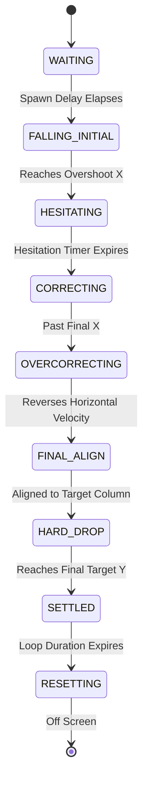

# JLUG Website — Technical & Structural Specifications

**Project:** Jabalpur Engineering College Linux Users Group (JLUG) Official Website (2026)  
**Version:** 0.1.0  
**Framework:** Next.js 16.3.5 (App Router)  
**UI Engine:** React 19.2.8 | TypeScript 5 | Tailwind CSS v4  
**Design System:** Dark Technical Editorial & Canvas-based Physics Simulation  

---

## 1. System Architecture & Core Philosophy

The JLUG website is designed as a **dark digital clubhouse** for students who build, experiment, and collaborate. The architecture adheres strictly to the **JLUG Core Modularity Rules**:

1. **Separation of Concerns:** UI Markup $\neq$ Canvas Physics Engine $\neq$ Content Data.
2. **Modular Subsystems:** Features are split into domain-specific modules (e.g., `src/features/hero`).
3. **Centralized Configuration:** All physics constants, animation durations, visual weights, and layout geometry reside in immutable configuration objects.
4. **No Monolithic Files:** Page layouts delegate rendering to specialized subcomponents.

---

## 2. Directory & Structural Layout

```text
JLUG-2026/
├── docs/                                # Project Specifications & Guidelines
│   ├── JLUG_AI_CODING_AGENT_BRIEF.md    # Agent guidelines & design constraints
│   ├── JLUG_DESIGN_SYSTEM.md            # Typography, colors, and layout rules
│   └── JLUG_WEBSITE_ARCHITECTURE.md     # Route descriptions & content guidelines
├── public/                              # Static public assets
├── src/
│   ├── app/                             # Next.js App Router Page Boundaries
│   │   ├── events/                      # Event archives & detail route (/events)
│   │   │   └── page.tsx
│   │   ├── hall-of-fame/                # Legacy timeline route (/hall-of-fame)
│   │   │   └── page.tsx
│   │   ├── join/                        # Recruitment & application route (/join)
│   │   │   └── page.tsx
│   │   ├── members/                     # Member directory route (/members)
│   │   │   └── page.tsx
│   │   ├── favicon.ico
│   │   ├── globals.css                  # Design system tokens & Tailwind v4 `@theme`
│   │   ├── layout.tsx                   # Root HTML shell, fonts & global backdrop
│   │   └── page.tsx                     # Landing page assembly
│   ├── components/                      # Shared UI Components
│   │   ├── InteractiveWordmark.tsx      # SVG/Canvas wordmark header element
│   │   ├── PlaceholderPage.tsx          # Utility page template for pending routes
│   │   ├── SiteNav.tsx                  # Responsive navigation bar with drawer
│   │   └── StudioBackdrop.tsx           # Technical grid backdrop & grain overlay
│   ├── features/                        # Feature-Specific Subsystems
│   │   └── hero/                        # Interactive Hero Subsystem
│   │       ├── components/
│   │       │   └── FallingBlockScene.tsx # High-DPI HTML5 Canvas animation host
│   │       ├── data/
│   │       │   ├── config.ts            # Hero physics & spawner parameters
│   │       │   └── jlugShape.ts         # Vector cell matrices for JLUG wordmark
│   │       └── engine/
│   │           ├── blockPhysics.ts      # Physics loop, collision & mouse displacement
│   │           ├── blockSpawner.ts      # Chunking algorithm & spawn generator
│   │           └── types.ts             # BlockState, BlockPiece & type definitions
│   └── lib/                             # Utility Functions & Configuration Data
│       └── navigation.ts                # Site navigation structure & active route helpers
├── AGENTS.md                            # Permanent modularity rules & Next.js directives
├── next.config.ts                       # Next.js build configuration
├── package.json                         # Dependencies & project scripts
├── postcss.config.mjs                   # PostCSS pipeline configuration
└── tsconfig.json                        # TypeScript compiler parameters
```

---

## 3. Technology Stack & Dependencies

| Layer | Technology | Purpose |
| :--- | :--- | :--- |
| **Framework** | Next.js 16.3.5 | App Router, Server Components, Route Handling |
| **Language** | TypeScript 5 | Static Type Safety across Engine & UI |
| **Styling** | Tailwind CSS v4 | CSS Custom Properties, Theme Configuration |
| **Font Family** | Geist Sans & Geist Mono | Editorial & Technical Typography via `next/font` |
| **Canvas Graphics** | HTML5 2D Context | High-performance falling block physics simulation |
| **Linting** | ESLint 9 | Code quality enforcement |

---

## 4. Information Architecture & Routing

The application follows Next.js App Router conventions with 5 primary routes:

| Route | Page | Purpose |
| :--- | :--- | :--- |
| `/` | **Home** | Interactive falling-block hero, editorial about section, discipline showcase, member teasers, and recruitment CTA. |
| `/events` | **Events Archive** | Timeline of past hackathons, workshops, and flagship community events (e.g., Codekumbh). |
| `/hall-of-fame` | **Hall of Fame** | Historical timeline (2019–Present) celebrating past presidents, club leaders, and milestones. |
| `/members` | **Members Directory** | Interactive identity card grid displaying active builders, filtering by domain (Tech, Design, AI, etc.). |
| `/join` | **Recruitment** | Call-to-action landing page with Google Form integration and application status details. |
| `/404` | **Not Found** | Custom error page with mascot (Pingu Tiwari) interaction and navigation recovery. |

---

## 5. Design System & Theme Specification

Defined inside `src/app/globals.css` using Tailwind CSS v4 `@theme` directives:

### 5.1 Color Palette

```css
--color-jlug-black: #070707;          /* Primary dark background */
--color-jlug-ink: #0B0B0B;            /* Deep container background */
--color-jlug-surface: #111111;        /* Surface element background */
--color-jlug-surface-raised: #171717; /* Card / Active nav item background */

--color-jlug-white: #F2F0E8;          /* Primary editorial text (off-white) */
--color-jlug-white-soft: #D7D5CE;     /* Secondary text */

--color-jlug-gray-1: #A3A29C;         /* Subdued body text */
--color-jlug-gray-2: #777770;         /* Technical labels & borders */
--color-jlug-gray-3: #494944;         /* Subtle grid lines */

--color-jlug-line: #292926;           /* Thin visual boundary lines */
--color-jlug-accent: #B7F34A;         /* Restrained lime accent */
```

### 5.2 Typography Hierarchy

- **Primary Sans Font:** `Geist Sans` (`var(--font-geist-sans)`) — Editorial headlines, body copy.
- **Monospace Font:** `Geist Mono` (`var(--font-geist-mono)`) — Technical metadata, index badges, navigation.
- **Hero Display Size:** Clamped fluid typography `clamp(5rem, 16vw, 15rem)` with $-0.07\text{em}$ letter spacing.

---

## 6. Interactive Hero Physics Engine Subsystem

The Hero section (`src/features/hero`) features a custom-built 2D physics simulation rendered on HTML5 Canvas.

### 6.1 Data Structures & Cell Grid

- **Internal Resolution:** $1200\text{px} \times 500\text{px}$ canvas space (scaled dynamically for high DPI screens).
- **Grid Resolution:** $20\text{px} \times 20\text{px}$ cells with $3\text{px}$ gap.
- **Letter Matrices (`jlugShape.ts`):** 2D array representation of target shapes for letters **J**, **L**, **U**, and **G**.

### 6.2 Chunking & Block Spawner (`blockSpawner.ts`)

Instead of rendering individual pixels, adjacent target cells are merged into multi-cell block chunks (max $5\times4$ cells) to simulate falling Tetris/assembly blocks.

### 6.3 Block Life-Cycle Finite State Machine (`types.ts`)

Each block piece transitions through 9 distinct physics states:



1. **`WAITING`**: Staggered delay before spawn.
2. **`FALLING_INITIAL`**: Block falls with horizontal overshoot simulating human inaccuracy.
3. **`HESITATING`**: Pause frame simulating human player thinking time.
4. **`CORRECTING`**: Nudging horizontal position toward the true target column.
5. **`OVERCORRECTING`**: Slight secondary horizontal overshoot.
6. **`FINAL_ALIGN`**: Locking exact X coordinate.
7. **`HARD_DROP`**: High-velocity downward drop to collision level.
8. **`SETTLED`**: Locked into place forming the wordmark.
9. **`RESETTING`**: Gravity release collapsing the shape before restarting the loop.

### 6.4 Mouse Interaction & Repulsion

When the cursor moves over settled blocks, a proximity displacement vector is applied:
$$\vec{F}_{\text{repulsion}} = \frac{\vec{r}_{\text{block}} - \vec{r}_{\text{cursor}}}{\|\vec{r}_{\text{block}} - \vec{r}_{\text{cursor}}\|^2} \cdot K$$
Blocks displace fluidly and return to target coordinates via elastic spring restoration when the cursor moves away.

---

## 7. Component Responsibilities

```text
RootLayout (src/app/layout.tsx)
├── StudioBackdrop (src/components/StudioBackdrop.tsx)  [Subtle technical grid]
├── SiteNav (src/components/SiteNav.tsx)                [Sticky header + Mobile Drawer]
└── Page Components (src/app/*/page.tsx)
    └── Hero Component (src/features/hero/components/FallingBlockScene.tsx)
        └── Engine (blockPhysics.ts + blockSpawner.ts + config.ts)
```

- **`SiteNav.tsx`**: Renders top navigation, route indicators (`01 /EVENTS`, `02 /HALL-OF-FAME`, etc.), and execution button (`EXEC /JOIN`).
- **`StudioBackdrop.tsx`**: Provides background grid pattern and noise texture without causing layout reflows.
- **`FallingBlockScene.tsx`**: Manages canvas lifecycle, `requestAnimationFrame` render loop, resize observer, and mouse input events.
- **`PlaceholderPage.tsx`**: Standardized fallback container for sub-routes during incremental development.

---

## 8. Performance, Responsiveness & Accessibility Specs

1. **High-DPI Display Scaling:** Canvas automatically computes `devicePixelRatio` to eliminate blurriness on Retina displays.
2. **Fluid Clamping:** Text scaling uses CSS `clamp()` to guarantee responsive display across mobile ($320\text{px}$) to Ultra-wide ($1440\text{px}+$ viewpoint boundaries).
3. **Reduced Motion:** Interactive canvas physics fallback gracefully if `prefers-reduced-motion` is active.
4. **Keyboard Accessibility:** Mobile navigation panel supports `Escape` key close handlers, and all navigable items feature visible focus states using `--color-jlug-accent`.

---

## 9. Verification & Build Commands

- **Development Server:** `npm run dev`
- **Production Build Validation:** `npm run build`
- **Lint Check:** `npm run lint`
